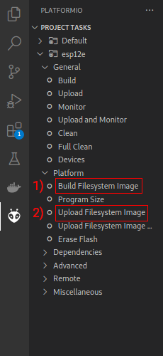

# IKEA Iskärna - Smart Home Modification (Home Assistant)

In this project, I have built a Home Assistant compatible version of the Iskärna lamp using an ESP8266 and a few ws2812b LEDs. The Arduino establishes a Wi-Fi connection with the local home network and then connects to an MQTT server. The [MQTT integration](https://www.home-assistant.io/integrations/mqtt/) is used for compatibility with Home Assistant.

The code can also be easily modified and used independently for LED strips or other ws2812b projects, regardless of the Iskärna lamp.

## Features

- Recognized as a lamp in Home Assistant
- Supports [MQTT-Discovery](https://www.home-assistant.io/integrations/mqtt/#mqtt-discovery), so no configuration is required in Home Assistant.
- Adjustable: status, brightness, color
- Effects: Rainbow (color changing), Pulse (pulsating current color)

## Hardware

Unfortunately, I have not yet found a way to modify the Iskärna LED controller and LED ring for my purposes. Therefore, they are completely replaced. The circuit diagram is very simple. The ws2812b LED strip only requires one data input.

### Parts list

1. Use this or compatible Ardunio [esp8266](https://www.amazon.de/-/en/gp/product/B01N9RXGHY/ref=ppx_yo_dt_b_asin_title_o05_s00?ie=UTF8&th=1).
2. WS2812B LEDs. I used a part of a [LED-strip](https://www.amazon.de/dp/B088B9QWHT?ref=ppx_yo2ov_dt_b_product_details&th=1) but a compatible led ring would be better.

## Setup

I used PlatformIO as the development environment.

1. Modify configuration file `data/config.json` and setup WiFi and MQTT. Note: I only tested the MQTT connection to a passwordless local mosquito broker. For remote brokers, modifications are probably required.

```
{
    "wifi_ssid": "XXXXX",
    "wifi_pass": "XXXXXXXX",
    "mqtt_server": "192.168.0.4",
    "mqtt_port": 1883,
    "mqtt_user": "",
    "mqtt_pass": "",
    "mqtt_ha_discovery_topic_prefix": "homeassistant",
    "mqtt_ha_unique_id": "IkeaSkaernaSmart"
}
```

2. Build and upload filesystem image



3. Build and upload sketch

4. After the arduino has connected to wifi and mqtt it will appear as an homeassistant entity
   

## Similar projects

[https://www.youtube.com/watch?v=TKuqhgjz_Cc](https://www.youtube.com/watch?v=TKuqhgjz_Cc)

[https://www.youtube.com/watch?v=LLD_A3J-rlE](https://www.youtube.com/watch?v=LLD_A3J-rlE)

## License

```
MIT License

Copyright (c) 2023 Philipp Kutsch

Permission is hereby granted, free of charge, to any person obtaining a copy
of this software and associated documentation files (the "Software"), to deal
in the Software without restriction, including without limitation the rights
to use, copy, modify, merge, publish, distribute, sublicense, and/or sell
copies of the Software, and to permit persons to whom the Software is
furnished to do so, subject to the following conditions:

The above copyright notice and this permission notice shall be included in all
copies or substantial portions of the Software.

THE SOFTWARE IS PROVIDED "AS IS", WITHOUT WARRANTY OF ANY KIND, EXPRESS OR
IMPLIED, INCLUDING BUT NOT LIMITED TO THE WARRANTIES OF MERCHANTABILITY,
FITNESS FOR A PARTICULAR PURPOSE AND NONINFRINGEMENT. IN NO EVENT SHALL THE
AUTHORS OR COPYRIGHT HOLDERS BE LIABLE FOR ANY CLAIM, DAMAGES OR OTHER
LIABILITY, WHETHER IN AN ACTION OF CONTRACT, TORT OR OTHERWISE, ARISING FROM,
OUT OF OR IN CONNECTION WITH THE SOFTWARE OR THE USE OR OTHER DEALINGS IN THE
SOFTWARE.
```

###### tags: `Ikea` `Iskärna` `Ikea Iskärna` `Arduino` `MQTT` `Home Assistant` `Smart` `Lamp` `WiFi` `Modification`
